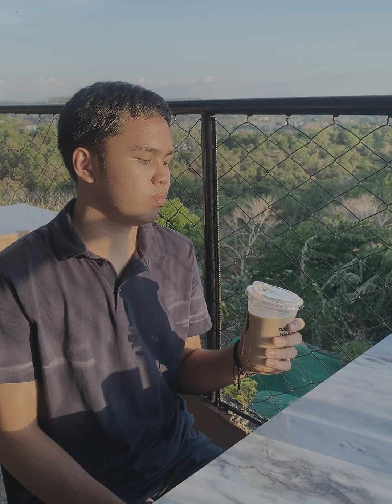

<a name="readme-top">

<br/>

<br />
<div align="center">
  <a href="https://github.com/MathCHewDoor/">
  <!-- TODO: If you want to add logo or banner you can add it here -->
    
  </a>
<!-- TODO: Change Title to the name of the title of your Project -->
  <h3 align="center">WD_Finals</h3>
</div>
<!-- TODO: Make a short description -->
<div align="center">
  This is my Final Project
</div>

<br />

<!-- TODO: Change the zyx-0314 into your github username  -->
<!-- TODO: Change the WD-Template-Project into the same name of your folder -->


---

<br />
<br />

<!-- TODO: If you want to add more layers for your readme -->
<details>
  <summary>Table of Contents</summary>
  <ol>
    <li>
      <a href="#overview">Overview</a>
      <ol>
        <li>
          <a href="#key-components">Key Components</a>
        </li>
        <li>
          <a href="#technology">Technology</a>
        </li>
      </ol>
    </li>
    <li>
      <a href="#rule,-practices-and-principles">Rules, Practices and Principles</a>
    </li>
    <li>
      <a href="#resources">Resources</a>
    </li>
  </ol>
</details>

---

## Overview

The project is a multi-page personal website showcasing my skills and portfolio as a web developer. Its purpose is to provide an interactive platform for visitors to explore my projects, view resume-like information, and navigate through an engaging overview of my abilities. Key components include distinct page designs, a project showcase with detailed descriptions and repository links, and a resume page highlighting skills and experience. The website utilizes pure HTML for structure, CSS for styling including libraries like Bootstrap for enhanced design, and JavaScript for interactive elements, ensuring a user-friendly experience.
---
### File Structure Explanation

This file structure organizes a project named WD-Finals, likely a web development portfolio or personal website. The main directory includes an index.html file serving as the homepage and a readme.md file for project documentation. The "assets" folder contains subdirectories for CSS stylesheets, images (in various formats like JPEG, JPG, WebP, and PNG), and JavaScript scripts used across different pages. The "pages" directory houses distinct sections such as projects, resume, about, and contacts, each with their own index.html file and corresponding assets subfolders for styling, images, and scripts. This structure ensures a clean organization of files, facilitating easy navigation and maintenance of the website.
---

### Project Repositories and Website Links

- https://github.com/MathChewDoor/WD-SEATWORK-2-TC03 (website link: https://mathchewdoor.github.io/WD-SEATWORK-2-TC03/)
- https://github.com/MathChewDoor/WD-Seatwork-3 (website link: https://mathchewdoor.github.io/WD-Seatwork-3/)
- https://github.com/MathChewDoor/WD-Seatwork-4 (website link: https://mathchewdoor.github.io/WD-Seatwork-4/)
---


### Technology
<!-- TODO: List of Technology Used -->


## Rules, Practices and Principles
1. Always use `WD-` in the front of the Title of the Project for the Subject followed by your custom naming.
2. Do not rename any .html files; always use `index.html` as the filename.
3. Place Files in their respective folders.
4. All file naming are in camel case.
   - Camel case is naming format where there is no white space in separation of each words, the first word is in all lower case while the succeding words first letter are in upper followed by lower cased letters.
   - ex.: buttonAnimatedStyle.css
5. Use only `External CSS`.
6. Renaming of Pages folder names are a must, and relates to what it is doing or data it holding.
7. File Structure below.

```
WD-Finals
└─ assets
|   └─ css
|   |   └─ style.css
|   └─ img
|   |   └─ fileWith.jpeg/.jpg/.webp/.png
|   └─ js
|       └─ script.js
└─ pages
| |└─ projects
| |   └─ assets
| |   |  └─ css
| |   |  |  └─ style.css
| |   |  └─ img
| |   |  |  └─ fileWith.jpeg/.jpg/.webp/.png
| |   |  └─ js
| |   |     └─ script.js
| |   └─ index.html
| └─ resume
| |   └─ assets
| |   |  └─ css
| |   |  |  └─ style.css
| |   |  └─ img
| |   |  |  └─ fileWith.jpeg/.jpg/.webp/.png
| |   |  └─ js
| |   |     └─ script.js
| |   └─ index.html
| └─ about
| |    └─ assets
| |   |  └─ css
| |   |  |  └─ style.css
| |   |  └─ img
| |   |  |  └─ fileWith.jpeg/.jpg/.webp/.png
| |   |  └─ js
| |   |     └─ script.js
| |   └─ index.html
| └─ contacts
|     └─ assets
|     |  └─ css
|     |  |  └─ style.css
|     |  └─ img
|     |  |  └─ fileWith.jpeg/.jpg/.webp/.png
|     |  └─ js
|     |     └─ script.js
|     └─ index.html
└─ index.html
└─ readme.md
```

## Resources

<!-- TODO: Add References -->
| Title | Purpose | Link |
|-|-|-|
| W3Schools | Get some samples of layouts and designs | https://www.w3schools.com |
| Github-Git-Guide | Used as guide for commit messages | https://github.com/zyx-0314/Github-Git-Guide |

---

### WakaTime Acc
https://wakatime.com/@MathChewDoor
